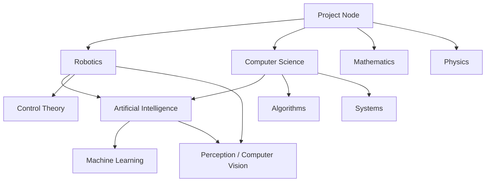

# Introduction

Hi, there! Welcome to the documentation for our project. We focus on accumulating knowledge valuable 
to the contributors. If you are interested in expanding the areas of interest with more content,
please feel free to reach out via discord.

All the content is under CC BY-SA 4.0 license.

Current focus areas include:

